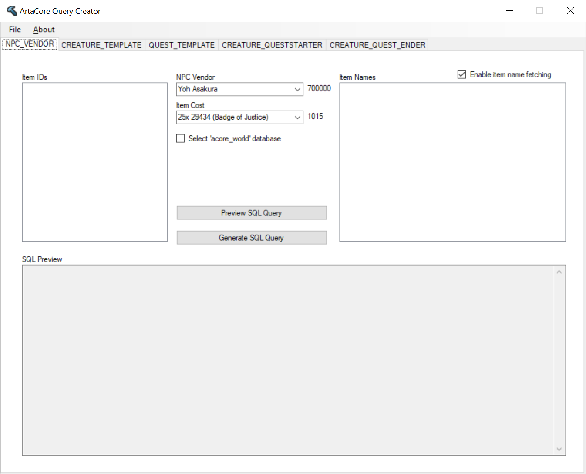
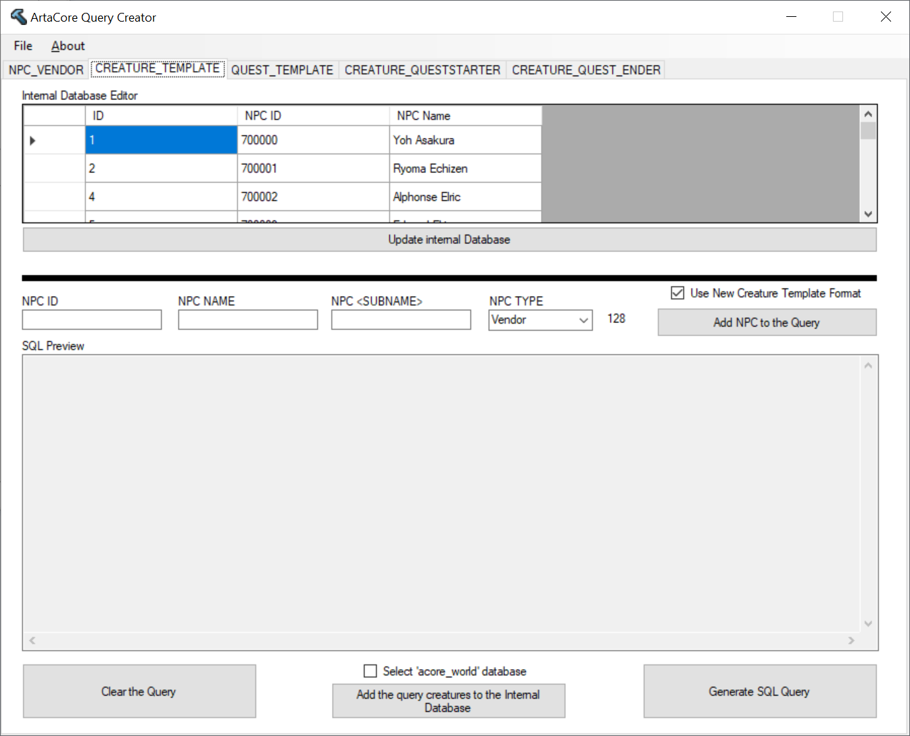
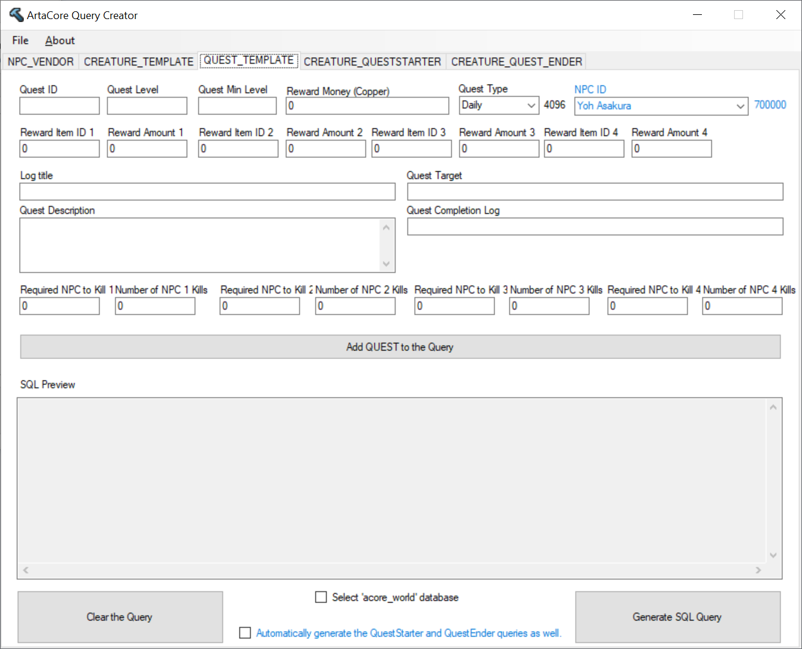
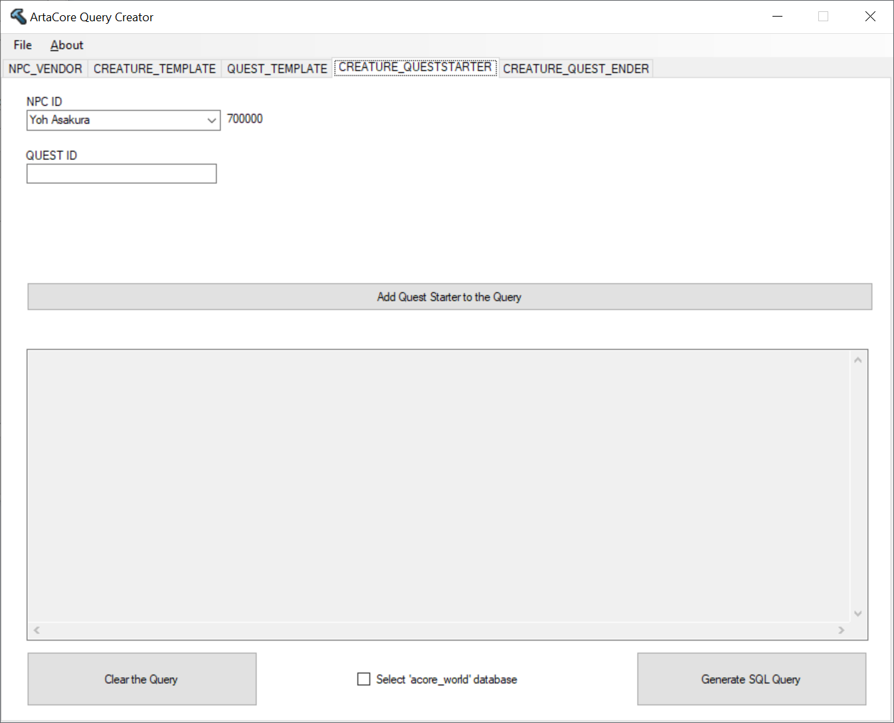
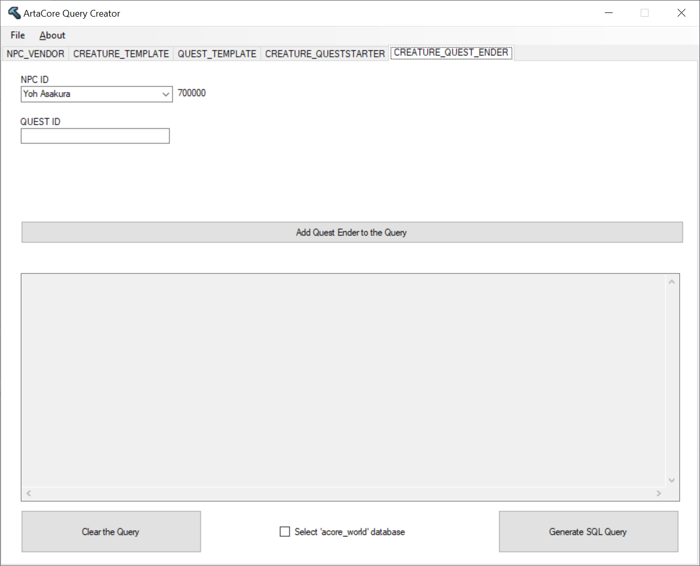

# ArtaCore Query Creator
A small utility to generate SQL queries for import in the ArtaCore server.

This takes care of simplifying the of .SQL queries to populate various tables in the AzerothCore ACoreWorld database.

This module allows you to populate the NPC_Vendor table with item IDs, being able to copy and paste a list of them (from XLS/Google Spreadsheet or even a notepad list), selecting the Vendor ID from a dropdown menu and generating a SQL (with preview) file that will import it in the correct Table.

This module allows you to create custom NPCs, preparing a query to populate the CREATURE_TEMPLATE table the correct IDs, NPC Name, NPC Subname and type.

This module allows you to create custom Quests, preparing a query to populate the QUEST_TEMPALTE table the correct information. You can select the related quest giver from the dropdown list.

These two modules allow you to link a quest to a given NPC quest giver. If you create a quest with the "Automatically generate the..." checkbox selected, this will be done for you automatically.

This utility also has a couple of internal databases, to simplify the operations. The internal "Item Cost" database (available in the NPC Vendor module) shows all ExtendedItemCosts values, in human readable format, available in the game. The other internal database is the NPC database (available for edit in the Creature Template module, but otherwise used in all NPC names dropdown), which allows you to quickly select a known NPC for the other modules. You can automatically add a new NPC to this internal database, or add new ones manually.

The software also has a SQL conversion tool for Creature_Template queries created for an older (< first months of 2021) AzerothCore database version which used a different Creature_Template table. The tool can be accessed with the FILE menu and allows you to convert an older SQL (created with the previous format) to the new one. Moreover, you can create both new version (August 2021 compliant) and old version (Pre April/June 2021) selecting the related checkbox in the Creature Template module.
